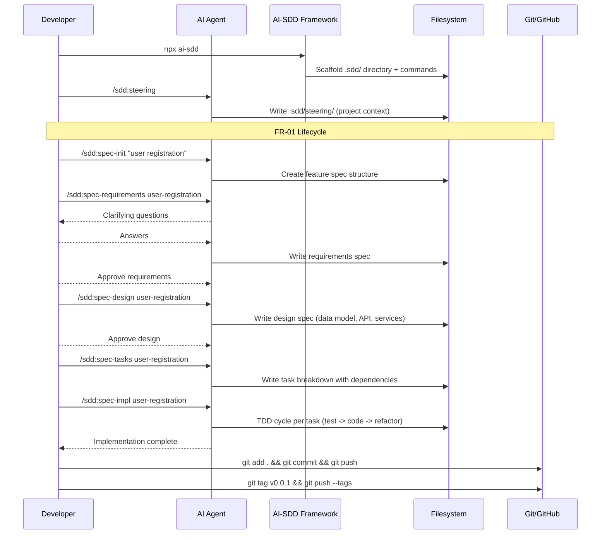

# How to Implement Features with AI-SDD

**Source:** https://ai-sdd.com/
**Philosophy:** Spec-as-source-of-truth with TDD. The Director-Executor-Contract model: you provide intent and constraints, AI implements within defined boundaries, specifications are the shared language.

---

## Prerequisites

- Node.js v18+
- Git
- AI coding agent (Claude Code, Cursor, Gemini CLI, Copilot, Windsurf, etc.)

## Project Setup

```bash
mkdir my-project && cd my-project
git init

# Install AI-SDD
npx ai-sdd
```

The installer scaffolds the `.sdd/` directory with steering files, commands, and workflow templates.

```bash
git add .
git commit -m "chore: initialize project with AI-SDD"
git remote add origin <your-repo-url>
git push -u origin main
```

---

## FR-01 -- User Registration

### Step 1: Establish project context (steering)

```
/sdd:steering
```

Define high-level project context: tech stack preferences, coding standards, architecture patterns, and non-functional requirements. This persists in `.sdd/steering/` as project memory across sessions.

### Step 2: Initialize the spec

```
/sdd:spec-init "User registration system with email/password authentication and JWT tokens"
```

Creates a structured plan under `.sdd/` with the feature scope and initial boundaries.

### Step 3: Gather requirements

```
/sdd:spec-requirements user-registration
```

The AI asks clarifying questions:
- What validation rules for email and password?
- Should email verification be included?
- JWT expiration policy?
- Error response format?

Your answers become the requirements spec. Three-phase approval gate: requirements must be approved before design.

### Step 4: Design the feature

```
/sdd:spec-design user-registration
```

The AI generates the technical design: data model, API contract, service architecture, security considerations. You review and approve before moving to tasks.

### Step 5: Generate implementation tasks

```
/sdd:spec-tasks user-registration
```

Breaks the design into ordered tasks with dependency tracking. Tasks marked `(P)` can run in parallel.

### Step 6: Implement with TDD

```
/sdd:spec-impl user-registration
```

The AI implements using a TDD cycle: write failing test, implement code, refactor. Each task follows red-green-refactor.

### Step 7: Commit and tag

```bash
git add .
git commit -m "feat(auth): add user registration (FR-01)"
git push
git tag v0.0.1
git push --tags
```

---

## FR-02 -- Board Management

### Step 1: Initialize and specify

```
/sdd:spec-init "Board management with CRUD operations for authenticated users"
/sdd:spec-requirements board-management
```

### Step 2: Design and plan

```
/sdd:spec-design board-management
/sdd:spec-tasks board-management
```

### Step 3: Implement

```
/sdd:spec-impl board-management
```

### Step 4: Commit and tag

```bash
git add .
git commit -m "feat(boards): add board management (FR-02)"
git push
git tag v0.0.2
git push --tags
```

---

## FR-03 -- Real-time Notifications

### Step 1: Initialize and specify

```
/sdd:spec-init "Real-time notifications via WebSocket when cards change status"
/sdd:spec-requirements notifications
```

### Step 2: Design and validate

```
/sdd:spec-design notifications
/sdd:validate-design
```

The `/sdd:validate-design` command checks for architectural consistency with existing features.

### Step 3: Generate tasks and implement

```
/sdd:spec-tasks notifications
/sdd:spec-impl notifications
```

### Step 4: Commit, PR, and release

```bash
git add .
git commit -m "feat(notifications): add real-time notifications (FR-03)"
git push
```

```bash
gh pr create \
  --title "Release 1.0.0 -- User Registration, Boards, Notifications" \
  --body "## Summary
- FR-01: User registration with JWT (TDD)
- FR-02: Board CRUD operations (TDD)
- FR-03: Real-time notifications via WebSocket (TDD)

## AI-SDD Artifacts
- Steering context in .sdd/steering/
- Per-feature: requirements, design, tasks specs
- All features implemented with TDD (red-green-refactor)"
```

After PR approval and merge:

```bash
git checkout main && git pull
git tag v1.0.0
git push --tags
```

---

## Sequence Diagram



---

## Process Diagram

```mermaid
flowchart TD
    Start([Project Init]) --> Install["npx ai-sdd"]
    Install --> GitInit["git init + initial commit"]

    GitInit --> Steering["/sdd:steering (project context)"]
    Steering --> FR01_Start["FR-01: User Registration"]

    subgraph FR01 [FR-01 Cycle]
        FR01_Start --> Init1["/sdd:spec-init"]
        Init1 --> Req1["/sdd:spec-requirements"]
        Req1 --> ReqGate1{Requirements Approved?}
        ReqGate1 -->|Yes| Design1["/sdd:spec-design"]
        ReqGate1 -->|No| Req1
        Design1 --> DesignGate1{Design Approved?}
        DesignGate1 -->|Yes| Tasks1["/sdd:spec-tasks"]
        DesignGate1 -->|No| Design1
        Tasks1 --> Impl1["/sdd:spec-impl (TDD)"]
        Impl1 --> TDD1["Red -> Green -> Refactor"]
        TDD1 --> Commit1["git commit + tag v0.0.1"]
    end

    Commit1 --> FR02_Start["FR-02: Board Management"]

    subgraph FR02 [FR-02 Cycle]
        FR02_Start --> Init2["/sdd:spec-init"]
        Init2 --> Req2["/sdd:spec-requirements"]
        Req2 --> Design2["/sdd:spec-design"]
        Design2 --> Tasks2["/sdd:spec-tasks"]
        Tasks2 --> Impl2["/sdd:spec-impl (TDD)"]
        Impl2 --> Commit2["git commit + tag v0.0.2"]
    end

    Commit2 --> FR03_Start["FR-03: Notifications"]

    subgraph FR03 [FR-03 Cycle]
        FR03_Start --> Init3["/sdd:spec-init"]
        Init3 --> Req3["/sdd:spec-requirements"]
        Req3 --> Design3["/sdd:spec-design"]
        Design3 --> Validate3["/sdd:validate-design"]
        Validate3 --> Tasks3["/sdd:spec-tasks"]
        Tasks3 --> Impl3["/sdd:spec-impl (TDD)"]
        Impl3 --> Commit3["git commit + push"]
    end

    Commit3 --> PR["gh pr create (Release 1.0.0)"]
    PR --> MergeReview{PR Review}
    MergeReview -->|Approved| Merge["Merge + git tag v1.0.0"]
    MergeReview -->|Changes Requested| FR03_Start
    Merge --> Done([Release 1.0.0])
```


