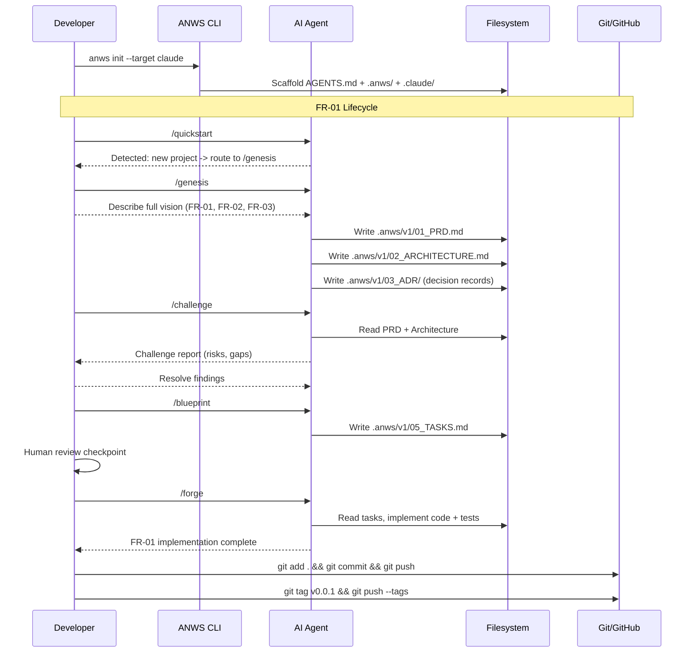

# How to Implement Features with ANWS

**Source:** https://github.com/Haaaiawd/ANWS
**Philosophy:** Four principles -- Axiom (principle before implementation), Nexus (connection before fragmentation), Weave (coherence before accumulation), Sovereignty (human judgment before automation). Design-first, spec-driven workflow.

---

## Prerequisites

- Node.js v18+
- Git
- AI IDE (Claude Code, Cursor, Windsurf, Copilot, etc.)

## Project Setup

```bash
mkdir my-project && cd my-project
git init

# Install ANWS globally
npm install -g @haaaiawd/anws

# Initialize with your target IDE(s)
anws init --target claude,cursor
```

This creates:
- `AGENTS.md` -- root anchor file (recovery point for AI sessions)
- `.anws/` -- versioned architecture docs and changelog
- `.claude/commands/` + `.claude/skills/` -- IDE-native commands
- `.cursor/commands/` + `.cursor/skills/` -- IDE-native commands

```bash
git add .
git commit -m "chore: initialize project with ANWS"
git remote add origin <your-repo-url>
git push -u origin main
```

---

## FR-01 -- User Registration

### Step 1: Quickstart (auto-detect path)

```
/quickstart
```

ANWS detects you're starting from zero and routes you to the genesis workflow.

### Step 2: Genesis -- create PRD and architecture from idea

```
/genesis
```

Describe your full vision:

> "A web application with user registration (email/password + JWT), board management, and real-time notifications. Starting with user registration."

The genesis workflow produces:
- `.anws/v1/01_PRD.md` -- Product Requirements Document
- `.anws/v1/02_ARCHITECTURE.md` -- System architecture
- `.anws/v1/03_ADR/` -- Architecture Decision Records (tech stack, auth strategy, etc.)

### Step 3: Challenge the design (optional but recommended)

```
/challenge
```

Reviews the PRD and architecture with adversarial pressure. Surfaces risks, contradictions, and missing considerations. Produces a challenge report.

### Step 4: Blueprint -- break into executable tasks

```
/blueprint
```

Decomposes the architecture into ordered, executable tasks:
- `.anws/v1/05_TASKS.md` -- task list with dependencies, acceptance criteria, file paths

### Step 5: Forge -- implement FR-01

```
/forge
```

The forge workflow reads the approved tasks and implements them:
- User model and database schema
- Registration endpoint with validation
- Password hashing
- JWT generation
- Error handling
- Tests

Human review checkpoint after implementation.

### Step 6: Commit and tag

```bash
git add .
git commit -m "feat(auth): add user registration (FR-01)"
git push
git tag v0.0.1
git push --tags
```

---

## FR-02 -- Board Management

### Step 1: Design the new system component

```
/design-system
```

> "Board management: CRUD operations for boards belonging to authenticated users."

Produces a focused system design document for the board module within the existing architecture.

### Step 2: Blueprint the tasks

```
/blueprint
```

Generates new tasks for board management, respecting dependencies on the existing user system.

### Step 3: Forge the implementation

```
/forge
```

Implements board creation, renaming, deletion, listing, and tests.

### Step 4: Commit and tag

```bash
git add .
git commit -m "feat(boards): add board management (FR-02)"
git push
git tag v0.0.2
git push --tags
```

---

## FR-03 -- Real-time Notifications

### Step 1: Explore the approach (optional)

```
/explore
```

> "Research WebSocket approaches for real-time notifications in our stack."

Produces an exploration report on technology options and trade-offs.

### Step 2: Design, blueprint, and forge

```
/design-system
```

> "Notification service: WebSocket-based real-time notifications when cards change status."

```
/challenge
/blueprint
/forge
```

### Step 3: Commit, PR, and release

```bash
git add .
git commit -m "feat(notifications): add real-time notifications (FR-03)"
git push
```

```bash
gh pr create \
  --title "Release 1.0.0 -- User Registration, Boards, Notifications" \
  --body "## Summary
- FR-01: User registration with JWT
- FR-02: Board CRUD operations
- FR-03: Real-time notifications via WebSocket

## ANWS Artifacts
- PRD, Architecture, ADRs in .anws/v1/
- Task breakdown in 05_TASKS.md
- Challenge reports for design validation
- AGENTS.md as root anchor"
```

After PR approval and merge:

```bash
git checkout main && git pull
git tag v1.0.0
git push --tags
```

---

## Sequence Diagram



---

## Process Diagram

```mermaid
flowchart TD
    Start([Project Init]) --> Install["anws init --target claude"]
    Install --> GitInit["git init + initial commit"]

    GitInit --> QS["/quickstart"]
    QS --> Genesis["/genesis (PRD + Architecture + ADRs)"]

    Genesis --> FR01_Start["FR-01: User Registration"]

    subgraph FR01 [FR-01 Cycle]
        FR01_Start --> Challenge1["/challenge (adversarial review)"]
        Challenge1 --> ChallengeOk1{Design Sound?}
        ChallengeOk1 -->|Yes| Blueprint1["/blueprint (task decomposition)"]
        ChallengeOk1 -->|Refine| Genesis
        Blueprint1 --> HumanReview1{Human Review Tasks}
        HumanReview1 -->|Approved| Forge1["/forge (implement)"]
        HumanReview1 -->|Revise| Blueprint1
        Forge1 --> Commit1["git commit + tag v0.0.1"]
    end

    Commit1 --> FR02_Start["FR-02: Board Management"]

    subgraph FR02 [FR-02 Cycle]
        FR02_Start --> Design2["/design-system (board module)"]
        Design2 --> Blueprint2["/blueprint"]
        Blueprint2 --> HumanReview2{Human Review}
        HumanReview2 -->|Approved| Forge2["/forge"]
        HumanReview2 -->|Revise| Design2
        Forge2 --> Commit2["git commit + tag v0.0.2"]
    end

    Commit2 --> FR03_Start["FR-03: Notifications"]

    subgraph FR03 [FR-03 Cycle]
        FR03_Start --> Explore3["/explore (research WebSockets)"]
        Explore3 --> Design3["/design-system"]
        Design3 --> Challenge3["/challenge"]
        Challenge3 --> Blueprint3["/blueprint"]
        Blueprint3 --> Forge3["/forge"]
        Forge3 --> Commit3["git commit + push"]
    end

    Commit3 --> PR["gh pr create (Release 1.0.0)"]
    PR --> MergeReview{PR Review}
    MergeReview -->|Approved| Merge["Merge + git tag v1.0.0"]
    MergeReview -->|Changes Requested| FR03_Start
    Merge --> Done([Release 1.0.0])
```


