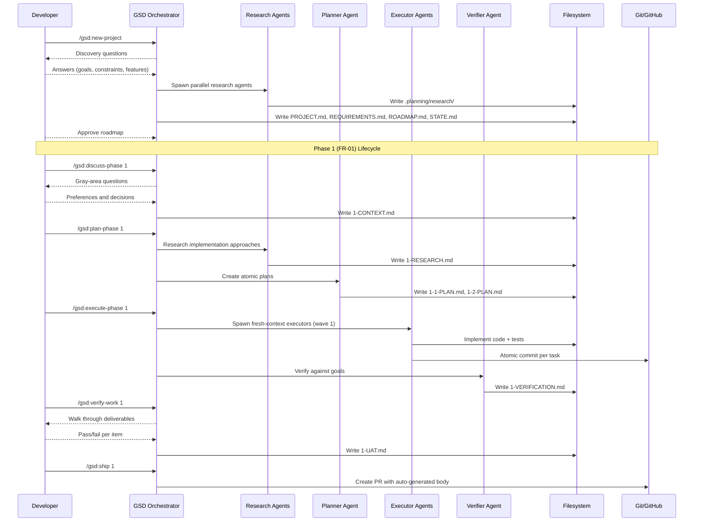

# How to Implement Features with Get-Shit-Done (GSD)

**Source:** https://github.com/gsd-build/get-shit-done
**Philosophy:** Anti-context-rot system that uses fresh 200k-token contexts per task, parallel wave execution, and structured meta-prompting to make AI coding reliable.

---

## Prerequisites

- Node.js v20+
- Git
- Claude Code (or OpenCode, Gemini CLI, Codex, Copilot, Cursor, Windsurf, Antigravity)

## Project Setup

```bash
mkdir my-project && cd my-project
git init
npx get-shit-done-cc@latest
# Select: Claude Code (or your runtime -- multi-select supported)
# Select: Local (current project)
```

Verify installation:

```
/gsd:help
```

```bash
git add .
git commit -m "chore: initialize project with GSD"
git remote add origin <your-repo-url>
git push -u origin main
```

---

## FR-01 -- User Registration

### Step 1: Initialize the project

```
/gsd:new-project
```

Use `--auto` to run autonomously with fewer prompts.

> **Already have code?** Run `/gsd:map-codebase` first. It spawns parallel agents to analyze your stack, architecture, conventions, and concerns. Then `/gsd:new-project` knows your codebase -- questions focus on what you're adding, and planning automatically loads your patterns.

The system starts an interactive flow:
1. **Questions** -- asks about your goals, constraints, tech preferences, edge cases
2. **Research** -- spawns parallel agents to investigate the domain
3. **Requirements** -- extracts v1 scope (include FR-01, FR-02, FR-03)
4. **Roadmap** -- creates phased delivery plan

Describe your full vision and approve the roadmap. FR-01 (User Registration) becomes Phase 1.

**Creates:** `PROJECT.md`, `REQUIREMENTS.md`, `ROADMAP.md`, `STATE.md`, `.planning/research/`

### Step 2: Discuss Phase 1

```
/gsd:discuss-phase 1
```

Use `--batch` to answer a grouped set of questions at once instead of one-by-one.

The system identifies gray areas in the registration feature and asks targeted questions:
- Input validation rules? Password strength requirements?
- JWT expiration policy? Refresh tokens?
- Error response format?

Your answers are captured in a context file that feeds the planner and researcher.

**Creates:** `1-CONTEXT.md`

### Step 3: Plan Phase 1

```
/gsd:plan-phase 1
```

The system:
1. Researches implementation approaches (guided by your context decisions)
2. Creates 2-3 atomic task plans in XML structure
3. Verifies plans against requirements

**Creates:** `1-RESEARCH.md`, `1-1-PLAN.md`, `1-2-PLAN.md`

### Step 4: Execute Phase 1

```
/gsd:execute-phase 1
```

The system:
1. Groups plans into dependency-based waves
2. Runs each plan in a fresh 200k context window
3. Commits after each task
4. Verifies the codebase delivers what Phase 1 promised

**Creates:** `1-1-SUMMARY.md`, `1-2-SUMMARY.md`, `1-VERIFICATION.md`

### Step 5: Verify the work

```
/gsd:verify-work 1
```

The system walks you through testable deliverables one at a time. If something fails, it spawns debug agents and creates fix plans.

**Creates:** `1-UAT.md`

### Step 6: Ship Phase 1

```
/gsd:ship 1
```

GSD creates a PR with auto-generated body from the phase summaries. Use `--draft` for draft PRs.

Alternatively, commit and tag manually:

```bash
git add .
git commit -m "feat(auth): add user registration (FR-01)"
git push
git tag v0.0.1
git push --tags
```

---

## FR-02 -- Board Management

### Step 1: Discuss Phase 2

```
/gsd:discuss-phase 2
```

> Board CRUD: create, rename, delete. Boards belong to one user. List user's boards.

### Step 2: Plan Phase 2

```
/gsd:plan-phase 2
```

### Step 3: Execute Phase 2

```
/gsd:execute-phase 2
```

### Step 4: Verify

```
/gsd:verify-work 2
```

### Step 5: Ship Phase 2

```
/gsd:ship 2
```

Or manually:

```bash
git add .
git commit -m "feat(boards): add board management (FR-02)"
git push
git tag v0.0.2
git push --tags
```

---

## FR-03 -- Real-time Notifications

### Step 1: Discuss Phase 3

```
/gsd:discuss-phase 3
```

> WebSocket notifications when cards change status. Notify assigned users.

### Step 2: Plan and execute

```
/gsd:plan-phase 3
/gsd:execute-phase 3
```

### Step 3: Verify

```
/gsd:verify-work 3
```

### Step 4: Ship as PR

```
/gsd:ship 3
```

GSD creates a PR with auto-generated body from the phase summaries.

Alternatively, create the PR manually:

```bash
git add .
git commit -m "feat(notifications): add real-time notifications (FR-03)"
git push
```

```bash
gh pr create \
  --title "Release 1.0.0 -- User Registration, Boards, Notifications" \
  --body "## Summary
- FR-01: User registration with JWT (Phase 1)
- FR-02: Board CRUD operations (Phase 2)
- FR-03: Real-time notifications via WebSocket (Phase 3)

## GSD Artifacts
- PROJECT.md, REQUIREMENTS.md, ROADMAP.md
- Per-phase: CONTEXT, RESEARCH, PLAN, SUMMARY, VERIFICATION, UAT"
```

After PR approval and merge:

```bash
git checkout main && git pull
git tag v1.0.0
git push --tags
```

Complete the milestone:

```
/gsd:complete-milestone
```

Start the next version with `/gsd:new-milestone` -- same flow as `new-project` but for your existing codebase.

---

## Workflow Shortcut: `/gsd:next`

Not sure what comes next? Let GSD figure it out:

```
/gsd:next
```

Auto-detects your current state and runs the next logical step in the discuss -> plan -> execute -> verify -> ship cycle.

---

## Quick & Fast Modes

### `/gsd:quick` -- Ad-hoc tasks outside the phase system

For tasks that don't need full planning. Same agents, same quality, faster path.

```
/gsd:quick
> What do you want to do? "Add dark mode toggle to settings"
```

Composable flags:
- `--discuss` -- lightweight discussion to surface gray areas
- `--research` -- investigates approaches before planning
- `--full` -- enables plan-checking and post-execution verification

```
/gsd:quick --discuss --research --full
```

### `/gsd:fast` -- Inline trivial tasks

Skips planning entirely. Executes immediately.

```
/gsd:fast fix the typo in the navbar
```

---

## Session Management

| Command | What it does |
|---------|--------------|
| `/gsd:pause-work` | Create handoff when stopping mid-phase (writes `HANDOFF.json`) |
| `/gsd:resume-work` | Restore from last session |
| `/gsd:progress` | Where am I? What's next? |

---

## Configuration

### Model Profiles

Control which model each agent uses. Switch with `/gsd:set-profile <name>` or via `/gsd:settings`.

| Profile | Planning | Execution | Verification |
|---------|----------|-----------|--------------|
| `quality` | Opus | Opus | Sonnet |
| `balanced` (default) | Opus | Sonnet | Sonnet |
| `budget` | Sonnet | Sonnet | Haiku |
| `inherit` | Inherit | Inherit | Inherit |

Use `inherit` when running non-Anthropic providers or to follow the runtime's model selection.

### Workflow Agents

Toggle via `/gsd:settings`. These spawn additional agents during planning/execution.

| Setting | Default | What it does |
|---------|---------|--------------|
| `workflow.research` | `true` | Researches domain before planning each phase |
| `workflow.plan_check` | `true` | Verifies plans achieve phase goals before execution |
| `workflow.verifier` | `true` | Confirms must-haves were delivered after execution |
| `workflow.auto_advance` | `false` | Auto-chain discuss -> plan -> execute without stopping |
| `workflow.discuss_mode` | `discuss` | `discuss` (interview) or `assumptions` (codebase-first) |

### Git Branching

| Strategy | Behavior |
|----------|----------|
| `none` (default) | Commits to current branch |
| `phase` | Creates a branch per phase, merges at completion |
| `milestone` | One branch for entire milestone, merges at completion |

### Recommended: Skip Permissions Mode

GSD is designed for frictionless automation:

```bash
claude --dangerously-skip-permissions
```

---

## Additional Commands

| Command | What it does |
|---------|--------------|
| `/gsd:map-codebase [area]` | Analyze existing codebase before `new-project` (brownfield) |
| `/gsd:new-milestone [name]` | Start next version after completing a milestone |
| `/gsd:add-phase` | Append phase to roadmap |
| `/gsd:insert-phase [N]` | Insert urgent work between phases |
| `/gsd:review` | Cross-AI peer review of current phase or branch |
| `/gsd:ship [N] [--draft]` | Create PR from verified phase work |
| `/gsd:audit-milestone` | Verify milestone achieved its definition of done |
| `/gsd:debug [desc]` | Systematic debugging with persistent state |
| `/gsd:workstreams` | Manage parallel workstreams (list, create, switch, complete) |
| `/gsd:ui-phase [N]` | Generate UI design contract for frontend phases |
| `/gsd:health [--repair]` | Validate `.planning/` directory integrity |
| `/gsd:stats` | Display project statistics |
| `/gsd:help` | Show all commands and usage guide |
| `/gsd:update` | Update GSD with changelog preview |

---

## Sequence Diagram



---

## Process Diagram

```mermaid
flowchart TD
    Start([Project Init]) --> Install["npx get-shit-done-cc@latest"]
    Install --> GitInit["git init + initial commit"]

    GitInit --> NewProj["/gsd:new-project"]
    NewProj --> Questions["Questions + Research + Requirements"]
    Questions --> Roadmap["Approve ROADMAP.md"]

    Roadmap --> FR01_Start["Phase 1: FR-01 User Registration"]

    subgraph FR01 [Phase 1 Cycle]
        FR01_Start --> Discuss1["/gsd:discuss-phase 1"]
        Discuss1 --> Plan1["/gsd:plan-phase 1"]
        Plan1 --> Research1["Parallel research agents"]
        Research1 --> Plans1["Atomic XML plans created"]
        Plans1 --> Exec1["/gsd:execute-phase 1"]
        Exec1 --> Waves1["Wave execution (parallel)"]
        Waves1 --> Verify1["/gsd:verify-work 1"]
        Verify1 --> UAT1{UAT Pass?}
        UAT1 -->|Yes| Ship1["/gsd:ship 1"]
        UAT1 -->|No| FixPlans1["Auto-generated fix plans"]
        FixPlans1 --> Exec1
    end

    Ship1 --> FR02_Start["Phase 2: FR-02 Board Management"]

    subgraph FR02 [Phase 2 Cycle]
        FR02_Start --> Discuss2["/gsd:discuss-phase 2"]
        Discuss2 --> Plan2["/gsd:plan-phase 2"]
        Plan2 --> Exec2["/gsd:execute-phase 2"]
        Exec2 --> Verify2["/gsd:verify-work 2"]
        Verify2 --> Ship2["/gsd:ship 2"]
    end

    Ship2 --> FR03_Start["Phase 3: FR-03 Notifications"]

    subgraph FR03 [Phase 3 Cycle]
        FR03_Start --> Discuss3["/gsd:discuss-phase 3"]
        Discuss3 --> Plan3["/gsd:plan-phase 3"]
        Plan3 --> Exec3["/gsd:execute-phase 3"]
        Exec3 --> Verify3["/gsd:verify-work 3"]
        Verify3 --> Ship3["/gsd:ship 3"]
    end

    Ship3 --> MergeReview{PR Review}
    MergeReview -->|Approved| Merge["Merge + git tag v1.0.0"]
    MergeReview -->|Changes Requested| FR03_Start
    Merge --> Complete["/gsd:complete-milestone"]
    Complete --> Next["/gsd:new-milestone"]
    Next --> Done([Next Release Cycle])
```


