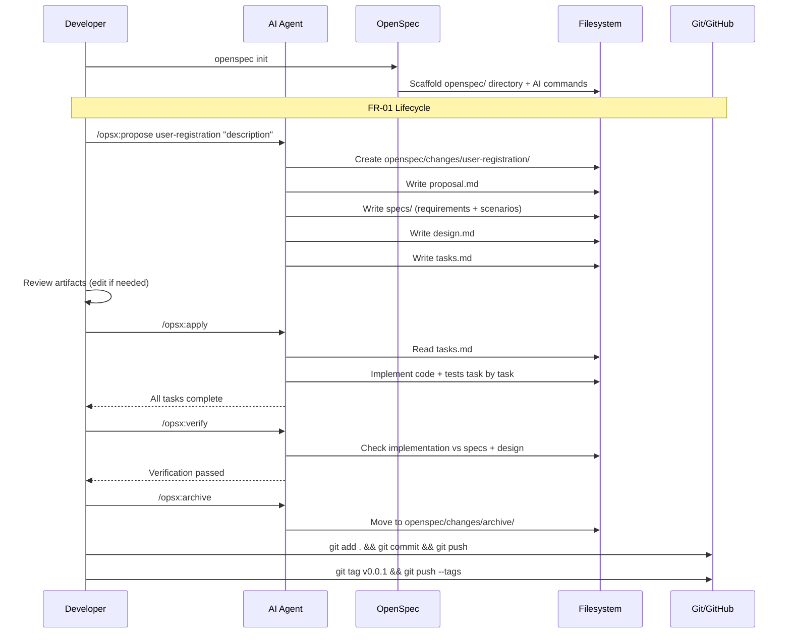

# How to Implement Features with OpenSpec

**Source:** https://github.com/Fission-AI/OpenSpec/
**Philosophy:** Fluid, iterative, artifact-guided workflow. Each change gets its own folder with proposal, specs, design, and tasks. Built for brownfield and greenfield alike.

---

## Prerequisites

- Node.js 20.19.0+
- Git
- AI coding assistant (Claude Code, Cursor, Gemini CLI, etc.)

## Project Setup

```bash
mkdir my-project && cd my-project
git init

# Install OpenSpec globally
npm install -g @fission-ai/openspec@latest

# Initialize in current directory
openspec init
```

```bash
git add .
git commit -m "chore: initialize project with OpenSpec"
git remote add origin <your-repo-url>
git push -u origin main
```

---

## FR-01 -- User Registration

### Step 1: Propose the feature

```
/opsx:propose user-registration "Users can register with email and password. System validates input, hashes password, stores user, and returns a JWT. Duplicate emails rejected."
```

OpenSpec creates a complete change folder:

```
openspec/changes/user-registration/
  proposal.md    -- why we're doing this, what's changing
  specs/         -- requirements and scenarios
  design.md      -- technical approach
  tasks.md       -- implementation checklist
```

### Step 2: Review artifacts

Read through the generated artifacts. Adjust any requirements, design decisions, or task ordering directly in the files. OpenSpec is fluid -- update any artifact at any time.

### Step 3: Implement the tasks

```
/opsx:apply
```

The AI agent reads `tasks.md` and implements each task sequentially:
- Database schema and user model
- Registration endpoint with validation
- Password hashing with bcrypt
- JWT token generation
- Error handling for duplicates
- Tests

### Step 4: Verify the implementation

```
/opsx:verify
```

Validates that the implementation matches the design and requirements in the specs.

### Step 5: Archive the change

```
/opsx:archive
```

Moves the completed change to `openspec/changes/archive/YYYY-MM-DD-user-registration/`.

### Step 6: Commit and tag

```bash
git add .
git commit -m "feat(auth): add user registration (FR-01)"
git push
git tag v0.0.1
git push --tags
```

---

## FR-02 -- Board Management

### Step 1: Propose the feature

```
/opsx:propose board-management "Users can create, rename, and delete boards. Each board belongs to one user. List boards for authenticated user."
```

### Step 2: Review and implement

Review `openspec/changes/board-management/` artifacts, then:

```
/opsx:apply
```

### Step 3: Verify and archive

```
/opsx:verify
/opsx:archive
```

### Step 4: Commit and tag

```bash
git add .
git commit -m "feat(boards): add board management (FR-02)"
git push
git tag v0.0.2
git push --tags
```

---

## FR-03 -- Real-time Notifications

### Step 1: Propose the feature

```
/opsx:propose realtime-notifications "Users receive real-time notifications via WebSocket when a card assigned to them changes status. Includes card title, old status, new status, timestamp."
```

### Step 2: Review, implement, verify

```
/opsx:apply
/opsx:verify
/opsx:archive
```

### Step 3: Commit, PR, and release

```bash
git add .
git commit -m "feat(notifications): add real-time notifications (FR-03)"
git push
```

```bash
gh pr create \
  --title "Release 1.0.0 -- User Registration, Boards, Notifications" \
  --body "## Summary
- FR-01: User registration with JWT
- FR-02: Board CRUD operations
- FR-03: Real-time notifications via WebSocket

## OpenSpec Artifacts
- Per-feature: proposal.md, specs/, design.md, tasks.md
- All changes verified and archived"
```

After PR approval and merge:

```bash
git checkout main && git pull
git tag v1.0.0
git push --tags
```

---

## Sequence Diagram



---

## Process Diagram

```mermaid
flowchart TD
    Start([Project Init]) --> Install["openspec init"]
    Install --> GitInit["git init + initial commit"]

    GitInit --> FR01_Start["FR-01: User Registration"]

    subgraph FR01 [FR-01 Cycle]
        FR01_Start --> Propose1["/opsx:propose user-registration"]
        Propose1 --> Artifacts1["proposal.md + specs/ + design.md + tasks.md"]
        Artifacts1 --> Review1{Human Review}
        Review1 -->|Approved| Apply1["/opsx:apply (implement)"]
        Review1 -->|Revise| EditArtifacts1["Edit artifacts directly"]
        EditArtifacts1 --> Review1
        Apply1 --> Verify1["/opsx:verify"]
        Verify1 --> VerifyOk1{Passes?}
        VerifyOk1 -->|Yes| Archive1["/opsx:archive"]
        VerifyOk1 -->|No| Apply1
        Archive1 --> Commit1["git commit + tag v0.0.1"]
    end

    Commit1 --> FR02_Start["FR-02: Board Management"]

    subgraph FR02 [FR-02 Cycle]
        FR02_Start --> Propose2["/opsx:propose board-management"]
        Propose2 --> Review2{Human Review}
        Review2 -->|Approved| Apply2["/opsx:apply"]
        Review2 -->|Revise| Propose2
        Apply2 --> Verify2["/opsx:verify"]
        Verify2 --> Archive2["/opsx:archive"]
        Archive2 --> Commit2["git commit + tag v0.0.2"]
    end

    Commit2 --> FR03_Start["FR-03: Notifications"]

    subgraph FR03 [FR-03 Cycle]
        FR03_Start --> Propose3["/opsx:propose realtime-notifications"]
        Propose3 --> Review3{Human Review}
        Review3 -->|Approved| Apply3["/opsx:apply"]
        Apply3 --> Verify3["/opsx:verify"]
        Verify3 --> Archive3["/opsx:archive"]
        Archive3 --> Commit3["git commit + push"]
    end

    Commit3 --> PR["gh pr create (Release 1.0.0)"]
    PR --> MergeReview{PR Review}
    MergeReview -->|Approved| Merge["Merge + git tag v1.0.0"]
    MergeReview -->|Changes Requested| FR03_Start
    Merge --> Done([Release 1.0.0])
```


