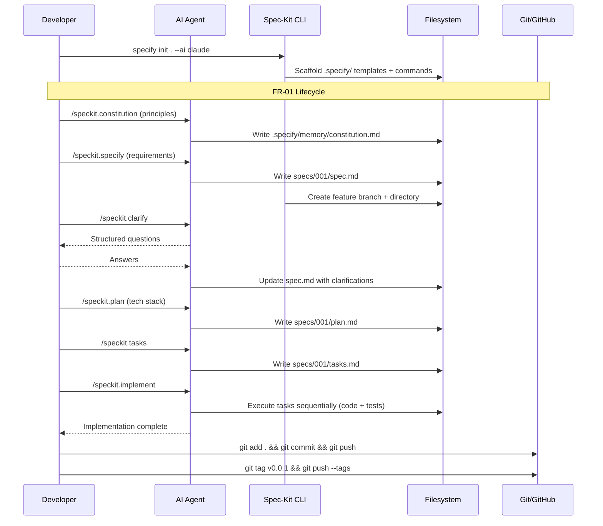

# How to Implement Features with Spec-Kit

**Source:** https://github.com/github/spec-kit
**Philosophy:** Constitution-first, spec-driven development where specifications define the "what" before the "how", with multi-step refinement rather than one-shot generation.

---

## Prerequisites

- Python 3.11+
- [uv](https://docs.astral.sh/uv/) package manager
- Git
- AI coding agent (Claude Code, Cursor, Copilot, etc.)

## Project Setup

```bash
mkdir my-project && cd my-project
git init

# Install Specify CLI (pin to latest release tag)
uv tool install specify-cli --from git+https://github.com/github/spec-kit.git@vX.Y.Z

# Initialize in current directory with your AI agent
specify init . --ai claude
specify check
```

```bash
git add .
git commit -m "chore: initialize project with Spec-Kit"
git remote add origin <your-repo-url>
git push -u origin main
```

---

## FR-01 -- User Registration

### Step 1: Establish project principles

```
/speckit.constitution Create principles focused on code quality, testing standards, security best practices, and API consistency
```

This creates `.specify/memory/constitution.md` with your project's governing guidelines.

### Step 2: Create the specification

```
/speckit.specify Users can register with email and password. The system validates input, hashes the password, stores the user, and returns a JWT token. Duplicate emails are rejected with a clear error.
```

This creates a `spec.md` in `.specify/specs/001-user-registration/` with user stories, functional requirements, and acceptance criteria.

### Step 3: Clarify requirements (optional but recommended)

```
/speckit.clarify
```

The agent asks structured questions to fill gaps in the spec. Answer each to tighten the requirements.

### Step 4: Create the technical plan

```
/speckit.plan Use Node.js with Express, PostgreSQL for storage, bcrypt for hashing, and jsonwebtoken for JWT. REST API.
```

This creates `plan.md` with architecture decisions, data model, file structure, and implementation steps.

### Step 5: Generate task breakdown

```
/speckit.tasks
```

Creates `tasks.md` with ordered, dependency-aware tasks including file paths and parallel execution markers.

### Step 6: Implement

```
/speckit.implement
```

The agent executes all tasks in order: models, services, endpoints, validation, error handling, and tests.

### Step 7: Commit and tag

```bash
git add .
git commit -m "feat(auth): add user registration (FR-01)"
git push
git tag v0.0.1
git push --tags
```

---

## FR-02 -- Board Management

### Step 1: Create the specification

```
/speckit.specify Users can create, rename, and delete boards. Each board belongs to one user. Boards have a title and creation timestamp. List boards for the authenticated user.
```

A new feature branch and spec directory are created (e.g., `002-board-management`).

### Step 2: Clarify and plan

```
/speckit.clarify
/speckit.plan Extend the existing Express API. Add Board model with foreign key to User. RESTful endpoints under /api/boards.
```

### Step 3: Generate tasks and implement

```
/speckit.tasks
/speckit.implement
```

### Step 4: Commit and tag

```bash
git add .
git commit -m "feat(boards): add board management (FR-02)"
git push
git tag v0.0.2
git push --tags
```

---

## FR-03 -- Real-time Notifications

### Step 1: Specify the feature

```
/speckit.specify Users receive real-time notifications via WebSocket when a card assigned to them changes status. Notifications include card title, old status, new status, and timestamp.
```

### Step 2: Clarify, plan, and analyze

```
/speckit.clarify
/speckit.plan Add Socket.IO for WebSocket support. Notification service emits events on card status change. Client subscribes on login.
/speckit.analyze
```

The `/speckit.analyze` command runs a cross-artifact consistency check before implementation.

### Step 3: Generate tasks and implement

```
/speckit.tasks
/speckit.implement
```

### Step 4: Commit, PR, and release

```bash
git add .
git commit -m "feat(notifications): add real-time notifications (FR-03)"
git push
```

```bash
gh pr create \
  --title "Release 1.0.0 -- User Registration, Boards, Notifications" \
  --body "## Summary
- FR-01: User registration with JWT authentication
- FR-02: Board CRUD operations
- FR-03: Real-time notifications via WebSocket

## Spec-Kit Artifacts
- constitution.md, spec.md, plan.md, tasks.md per feature
- Cross-artifact analysis passed for all three features"
```

After PR approval and merge:

```bash
git checkout main && git pull
git tag v1.0.0
git push --tags
```

---

## Sequence Diagram



---

## Process Diagram

```mermaid
flowchart TD
    Start([Project Init]) --> Install["specify init . --ai claude"]
    Install --> GitInit["git init + initial commit"]

    GitInit --> Const["/speckit.constitution"]
    Const --> FR01_Start["FR-01: User Registration"]

    subgraph FR01 [FR-01 Cycle]
        FR01_Start --> Spec1["/speckit.specify (requirements)"]
        Spec1 --> Clarify1["/speckit.clarify"]
        Clarify1 --> Plan1["/speckit.plan (tech stack)"]
        Plan1 --> Tasks1["/speckit.tasks"]
        Tasks1 --> ReviewTasks1{Review Tasks}
        ReviewTasks1 -->|Approved| Impl1["/speckit.implement"]
        ReviewTasks1 -->|Revise| Spec1
        Impl1 --> Commit1["git commit + tag v0.0.1"]
    end

    Commit1 --> FR02_Start["FR-02: Board Management"]

    subgraph FR02 [FR-02 Cycle]
        FR02_Start --> Spec2["/speckit.specify"]
        Spec2 --> Clarify2["/speckit.clarify"]
        Clarify2 --> Plan2["/speckit.plan"]
        Plan2 --> Tasks2["/speckit.tasks"]
        Tasks2 --> Impl2["/speckit.implement"]
        Impl2 --> Commit2["git commit + tag v0.0.2"]
    end

    Commit2 --> FR03_Start["FR-03: Notifications"]

    subgraph FR03 [FR-03 Cycle]
        FR03_Start --> Spec3["/speckit.specify"]
        Spec3 --> Clarify3["/speckit.clarify"]
        Clarify3 --> Plan3["/speckit.plan"]
        Plan3 --> Analyze3["/speckit.analyze"]
        Analyze3 --> Tasks3["/speckit.tasks"]
        Tasks3 --> Impl3["/speckit.implement"]
        Impl3 --> Commit3["git commit + push"]
    end

    Commit3 --> PR["gh pr create (Release 1.0.0)"]
    PR --> MergeReview{PR Review}
    MergeReview -->|Approved| Merge["Merge + git tag v1.0.0"]
    MergeReview -->|Changes Requested| FR03_Start
    Merge --> Done([Release 1.0.0])
```


