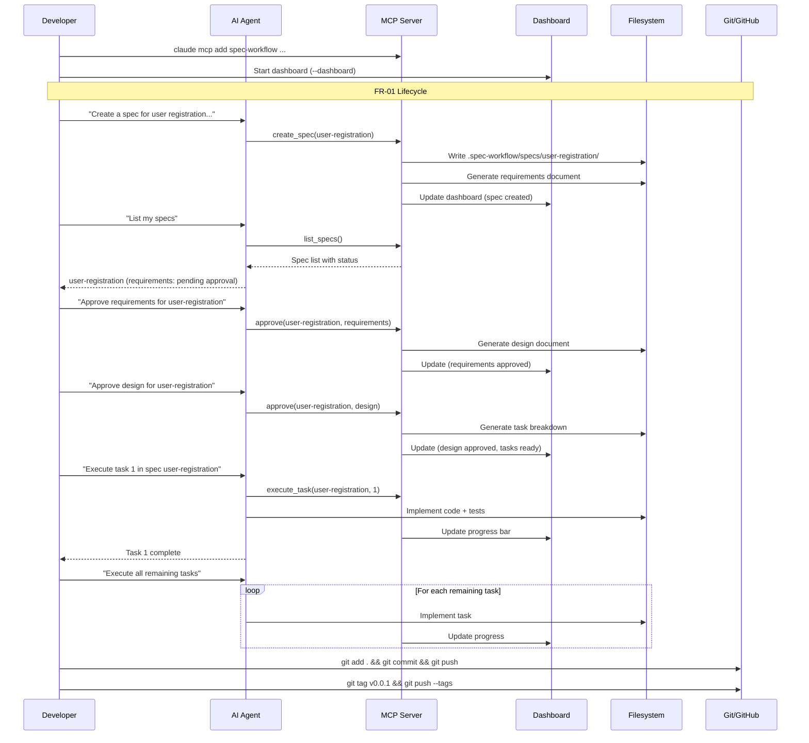

# How to Implement Features with Spec-Workflow-MCP

**Source:** https://github.com/Pimzino/spec-workflow-mcp
**Philosophy:** MCP-native, conversational interface for structured spec-driven development. Natural language instead of slash commands, with a real-time web dashboard for tracking.

---

## Prerequisites

- Node.js v18+
- Git
- AI coding agent with MCP support (Claude Code, Cursor, Windsurf, etc.)

## Project Setup

```bash
mkdir my-project && cd my-project
git init
```

### Add the MCP server to your AI tool

**Claude Code:**

```bash
claude mcp add spec-workflow npx @pimzino/spec-workflow-mcp@latest -- /path/to/my-project
```

**Cursor / Windsurf / other MCP clients** -- add to your MCP configuration:

```json
{
  "mcpServers": {
    "spec-workflow": {
      "command": "npx",
      "args": ["-y", "@pimzino/spec-workflow-mcp@latest", "/path/to/my-project"]
    }
  }
}
```

### Start the dashboard (optional but recommended)

```bash
npx -y @pimzino/spec-workflow-mcp@latest --dashboard
```

Dashboard available at: http://localhost:5000

```bash
git add .
git commit -m "chore: initialize project with Spec-Workflow-MCP"
git remote add origin <your-repo-url>
git push -u origin main
```

---

## FR-01 -- User Registration

### Step 1: Create the spec (natural language)

Tell your AI agent:

```
Create a spec for user registration. Users can register with email and password.
The system validates input, hashes the password, stores the user, and returns a JWT.
Duplicate emails are rejected with a clear error.
```

The MCP server creates a structured spec in `.spec-workflow/specs/` with:
- Requirements document
- Design document
- Task breakdown

The workflow is sequential: Requirements -> Design -> Tasks.

### Step 2: Review and approve the spec

Check the spec in the dashboard at http://localhost:5000, or ask your agent:

```
List my specs
```

Review the generated requirements. When satisfied, approve through the dashboard or tell the agent:

```
Approve the requirements for user-registration
```

The agent then generates the design document. Review and approve it to unlock task generation.

### Step 3: Execute tasks

```
Execute task 1 in spec user-registration
```

The agent implements the first task (e.g., database schema + user model).

Continue with each task:

```
Execute task 2 in spec user-registration
Execute task 3 in spec user-registration
```

Or ask the agent to execute all remaining tasks:

```
Execute all remaining tasks in spec user-registration
```

### Step 4: Monitor progress

```
Show progress for spec user-registration
```

Or check the real-time dashboard for visual progress bars and task status.

### Step 5: Commit and tag

```bash
git add .
git commit -m "feat(auth): add user registration (FR-01)"
git push
git tag v0.0.1
git push --tags
```

---

## FR-02 -- Board Management

### Step 1: Create the spec

```
Create a spec for board management. Users can create, rename, and delete boards.
Each board belongs to one user. List boards for the authenticated user.
```

### Step 2: Approve and execute

```
Approve the requirements for board-management
Approve the design for board-management
Execute all remaining tasks in spec board-management
```

### Step 3: Commit and tag

```bash
git add .
git commit -m "feat(boards): add board management (FR-02)"
git push
git tag v0.0.2
git push --tags
```

---

## FR-03 -- Real-time Notifications

### Step 1: Create the spec

```
Create a spec for real-time notifications. Users receive WebSocket notifications
when a card assigned to them changes status. Include card title, old status, new
status, and timestamp.
```

### Step 2: Approve and execute

```
Approve the requirements for realtime-notifications
Approve the design for realtime-notifications
Execute all remaining tasks in spec realtime-notifications
```

### Step 3: Commit, PR, and release

```bash
git add .
git commit -m "feat(notifications): add real-time notifications (FR-03)"
git push
```

```bash
gh pr create \
  --title "Release 1.0.0 -- User Registration, Boards, Notifications" \
  --body "## Summary
- FR-01: User registration with JWT
- FR-02: Board CRUD operations
- FR-03: Real-time notifications via WebSocket

## Spec-Workflow-MCP Artifacts
- Structured specs in .spec-workflow/specs/
- Requirements -> Design -> Tasks approval workflow per feature
- Dashboard tracking at localhost:5000"
```

After PR approval and merge:

```bash
git checkout main && git pull
git tag v1.0.0
git push --tags
```

---

## Sequence Diagram



---

## Process Diagram

```mermaid
flowchart TD
    Start([Project Init]) --> AddMCP["claude mcp add spec-workflow"]
    AddMCP --> Dashboard["Start dashboard (optional)"]
    Dashboard --> GitInit["git init + initial commit"]

    GitInit --> FR01_Start["FR-01: User Registration"]

    subgraph FR01 [FR-01 Cycle]
        FR01_Start --> Create1["'Create a spec for user registration'"]
        Create1 --> ReqGen1["MCP generates requirements"]
        ReqGen1 --> ReqReview1{Review Requirements}
        ReqReview1 -->|Approve| DesignGen1["MCP generates design"]
        ReqReview1 -->|Revise| Create1
        DesignGen1 --> DesignReview1{Review Design}
        DesignReview1 -->|Approve| TaskGen1["MCP generates tasks"]
        DesignReview1 -->|Revise| DesignGen1
        TaskGen1 --> Exec1["'Execute all tasks in spec'"]
        Exec1 --> Monitor1["Monitor on dashboard"]
        Monitor1 --> Commit1["git commit + tag v0.0.1"]
    end

    Commit1 --> FR02_Start["FR-02: Board Management"]

    subgraph FR02 [FR-02 Cycle]
        FR02_Start --> Create2["'Create a spec for board management'"]
        Create2 --> Approve2["Approve requirements + design"]
        Approve2 --> Exec2["'Execute all tasks'"]
        Exec2 --> Commit2["git commit + tag v0.0.2"]
    end

    Commit2 --> FR03_Start["FR-03: Notifications"]

    subgraph FR03 [FR-03 Cycle]
        FR03_Start --> Create3["'Create a spec for notifications'"]
        Create3 --> Approve3["Approve requirements + design"]
        Approve3 --> Exec3["'Execute all tasks'"]
        Exec3 --> Commit3["git commit + push"]
    end

    Commit3 --> PR["gh pr create (Release 1.0.0)"]
    PR --> MergeReview{PR Review}
    MergeReview -->|Approved| Merge["Merge + git tag v1.0.0"]
    MergeReview -->|Changes Requested| FR03_Start
    Merge --> Done([Release 1.0.0])
```


