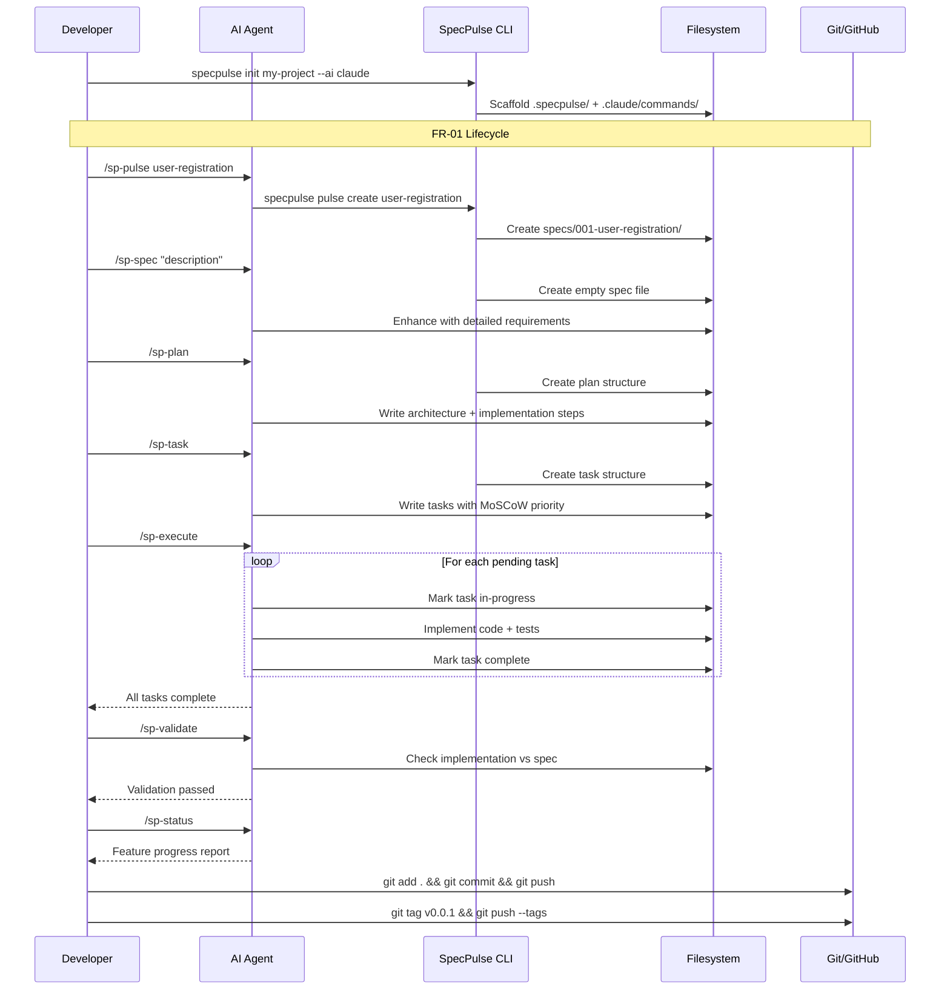

# How to Implement Features with SpecPulse

**Source:** https://github.com/specpulse/specpulse
**Philosophy:** CLI-first with AI enhancement. Structured specifications before code, with 11 identical commands across 8 AI platforms. MoSCoW prioritization for task breakdown.

---

## Prerequisites

- Python 3.11+
- pip
- Git
- AI coding assistant (Claude Code, Cursor, Gemini CLI, Windsurf, etc.)

## Project Setup

```bash
mkdir my-project && cd my-project
git init

# Install SpecPulse
pip install specpulse

# Initialize project with your AI platform
specpulse init my-project --ai claude
cd my-project
```

Project structure created:

```
my-project/
  .specpulse/        -- specs, plans, tasks
  .claude/           -- AI platform commands (auto-deployed)
  README.md
```

```bash
git add .
git commit -m "chore: initialize project with SpecPulse"
git remote add origin <your-repo-url>
git push -u origin main
```

---

## FR-01 -- User Registration

### Step 1: Initialize the feature

```
/sp-pulse user-registration
```

This is the entry point. Creates:
- Feature directory: `specs/001-user-registration/`
- Project context and metadata
- Feature tracking state

### Step 2: Create the specification

```
/sp-spec "Users can register with email and password. System validates input, hashes password, stores user, returns JWT. Duplicate emails rejected with clear error message."
```

The AI generates a comprehensive spec including:
- Problem statement and business context
- Functional requirements
- Security requirements
- API design with endpoint specs
- Data models and schemas
- Acceptance criteria

### Step 3: Generate the implementation plan

```
/sp-plan
```

The AI creates a detailed plan with:
- Architecture decisions and technology choices
- File structure for new/modified files
- Sequential implementation steps
- Dependencies between components
- Testing strategy

### Step 4: Break down into tasks

```
/sp-task
```

Generates actionable tasks with MoSCoW prioritization:
- Each task has an ID, status, description, files touched, success criteria
- Dependencies between tasks are tracked
- Tasks are ordered for implementation

### Step 5: Execute the tasks

```
/sp-execute
```

The AI implements tasks continuously: picks the next pending task, marks it in-progress, writes code, validates, marks complete, moves to next.

For specific task execution:

```
/sp-execute task-001
```

### Step 6: Validate the work

```
/sp-validate
```

Checks all completed tasks against their success criteria and the original specification.

### Step 7: Check progress and commit

```
/sp-status
```

Shows current feature progress with completion percentage.

```bash
git add .
git commit -m "feat(auth): add user registration (FR-01)"
git push
git tag v0.0.1
git push --tags
```

---

## FR-02 -- Board Management

### Step 1: Initialize the feature

```
/sp-pulse board-management
```

### Step 2: Specify, plan, task, execute

```
/sp-spec "Users can create, rename, and delete boards. Each board belongs to one user. List boards for authenticated user. Boards have title and creation timestamp."
/sp-plan
/sp-task
/sp-execute
```

### Step 3: Validate and commit

```
/sp-validate
/sp-status
```

```bash
git add .
git commit -m "feat(boards): add board management (FR-02)"
git push
git tag v0.0.2
git push --tags
```

---

## FR-03 -- Real-time Notifications

### Step 1: Initialize the feature

```
/sp-pulse realtime-notifications
```

### Step 2: Specify with detail

```
/sp-spec "Real-time notifications via WebSocket when a card assigned to a user changes status. Notification includes card title, old status, new status, and timestamp. Users subscribe on login."
```

### Step 3: Clarify requirements (optional)

```
/sp-clarify spec-001
```

The AI asks structured questions to resolve ambiguities.

### Step 4: Plan, task, execute, validate

```
/sp-plan
/sp-task
/sp-execute
/sp-validate
```

### Step 5: Commit, PR, and release

```bash
git add .
git commit -m "feat(notifications): add real-time notifications (FR-03)"
git push
```

```bash
gh pr create \
  --title "Release 1.0.0 -- User Registration, Boards, Notifications" \
  --body "## Summary
- FR-01: User registration with JWT
- FR-02: Board CRUD operations
- FR-03: Real-time notifications via WebSocket

## SpecPulse Artifacts
- Per-feature: spec, plan, tasks in .specpulse/
- All features validated against acceptance criteria
- MoSCoW prioritized task execution"
```

After PR approval and merge:

```bash
git checkout main && git pull
git tag v1.0.0
git push --tags
```

---

## Sequence Diagram



---

## Process Diagram

```mermaid
flowchart TD
    Start([Project Init]) --> Install["specpulse init my-project --ai claude"]
    Install --> GitInit["git init + initial commit"]

    GitInit --> FR01_Start["FR-01: User Registration"]

    subgraph FR01 [FR-01 Cycle]
        FR01_Start --> Pulse1["/sp-pulse user-registration"]
        Pulse1 --> Spec1["/sp-spec (requirements)"]
        Spec1 --> Plan1["/sp-plan (architecture)"]
        Plan1 --> Task1["/sp-task (MoSCoW breakdown)"]
        Task1 --> Exec1["/sp-execute"]
        Exec1 --> ExecLoop1["Continuous task execution"]
        ExecLoop1 --> Validate1["/sp-validate"]
        Validate1 --> ValOk1{Passes?}
        ValOk1 -->|Yes| Status1["/sp-status"]
        ValOk1 -->|No| Exec1
        Status1 --> Commit1["git commit + tag v0.0.1"]
    end

    Commit1 --> FR02_Start["FR-02: Board Management"]

    subgraph FR02 [FR-02 Cycle]
        FR02_Start --> Pulse2["/sp-pulse board-management"]
        Pulse2 --> Spec2["/sp-spec"]
        Spec2 --> Plan2["/sp-plan"]
        Plan2 --> Task2["/sp-task"]
        Task2 --> Exec2["/sp-execute"]
        Exec2 --> Validate2["/sp-validate"]
        Validate2 --> Commit2["git commit + tag v0.0.2"]
    end

    Commit2 --> FR03_Start["FR-03: Notifications"]

    subgraph FR03 [FR-03 Cycle]
        FR03_Start --> Pulse3["/sp-pulse realtime-notifications"]
        Pulse3 --> Spec3["/sp-spec"]
        Spec3 --> Clarify3["/sp-clarify"]
        Clarify3 --> Plan3["/sp-plan"]
        Plan3 --> Task3["/sp-task"]
        Task3 --> Exec3["/sp-execute"]
        Exec3 --> Validate3["/sp-validate"]
        Validate3 --> Commit3["git commit + push"]
    end

    Commit3 --> PR["gh pr create (Release 1.0.0)"]
    PR --> MergeReview{PR Review}
    MergeReview -->|Approved| Merge["Merge + git tag v1.0.0"]
    MergeReview -->|Changes Requested| FR03_Start
    Merge --> Done([Release 1.0.0])
```


