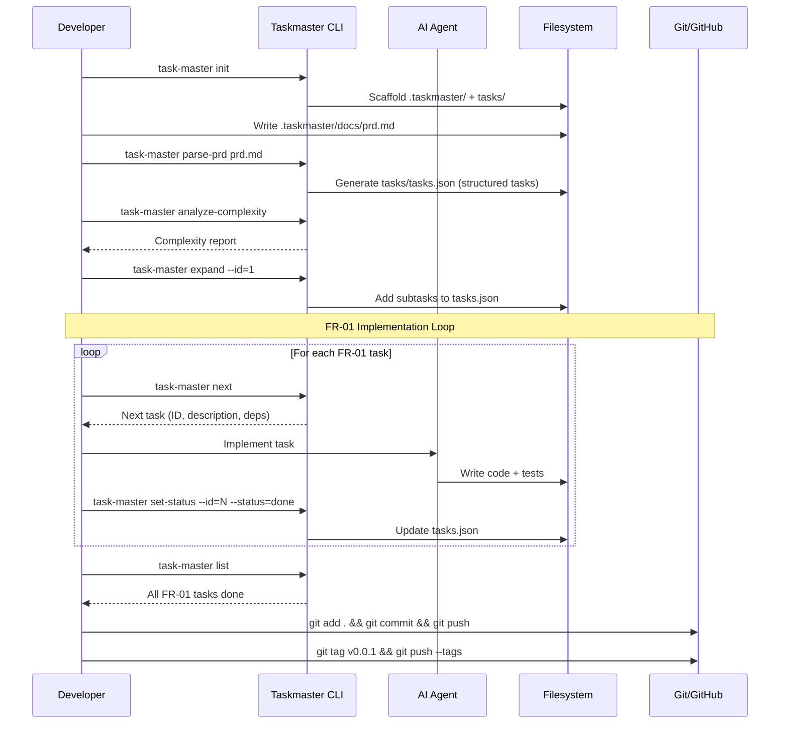

# How to Implement Features with Taskmaster

**Source:** https://www.task-master.dev/
**Philosophy:** PRD-driven, dependency-ordered task management. Parse a Product Requirements Document into structured tasks with topological ordering, then execute tasks sequentially guided by AI.

---

## Prerequisites

- Node.js v18+
- Git
- AI coding agent (Claude Code, Cursor, etc.)

## Project Setup

```bash
mkdir my-project && cd my-project
git init

# Install Taskmaster globally
npm install -g task-master-ai

# Initialize Taskmaster in your project
task-master init
```

This creates:
- `.taskmaster/` directory with configuration
- `.taskmaster/docs/` for PRD templates
- `tasks/` directory for generated task files

```bash
git add .
git commit -m "chore: initialize project with Taskmaster"
git remote add origin <your-repo-url>
git push -u origin main
```

---

## FR-01 -- User Registration

### Step 1: Write the PRD

Create a PRD in `.taskmaster/docs/prd.md` using the provided template. Include all three features so Taskmaster can understand the full scope and dependencies:

```markdown
# Product Requirements Document

## Overview
Web application with user management, boards, and notifications.

## Feature Requirements

### FR-01: User Registration
- Users register with email and password
- System validates input and hashes password
- Returns JWT on successful registration
- Rejects duplicate emails with clear error

### FR-02: Board Management
- CRUD operations for boards
- Each board belongs to one user
- List boards for authenticated user

### FR-03: Real-time Notifications
- WebSocket notifications on card status change
- Notify assigned users with card title, old/new status, timestamp
```

### Step 2: Parse the PRD into tasks

```bash
task-master parse-prd .taskmaster/docs/prd.md
```

This converts the PRD into `tasks/tasks.json` -- a structured task list with:
- Task IDs, titles, descriptions
- Dependencies between tasks
- Priority ordering
- Status tracking

### Step 3: Analyze complexity (optional)

```bash
task-master analyze-complexity
```

Identifies which tasks need further breakdown and which are straightforward.

### Step 4: Expand complex tasks into subtasks

```bash
task-master expand --id=1
task-master expand --id=2
```

Generates subtasks for complex tasks, giving the AI more granular instructions.

### Step 5: Get the next task

```bash
task-master next
```

Returns the next task to implement based on dependency order and status. For FR-01, this will be the foundational tasks (database setup, user model, etc.).

### Step 6: Implement the task

Use your AI agent to implement what `task-master next` returns. The task description includes context, dependencies, and acceptance criteria.

After implementation, update the status:

```bash
task-master set-status --id=1 --status=done
```

### Step 7: Repeat until FR-01 tasks are complete

```bash
task-master next
# ... implement ...
task-master set-status --id=2 --status=done

task-master next
# ... implement ...
task-master set-status --id=3 --status=done
```

### Step 8: List tasks to verify progress

```bash
task-master list
```

### Step 9: Commit and tag

```bash
git add .
git commit -m "feat(auth): add user registration (FR-01)"
git push
git tag v0.0.1
git push --tags
```

---

## FR-02 -- Board Management

### Step 1: Get next task (FR-02 tasks now unlocked)

```bash
task-master next
```

Dependencies from FR-01 are satisfied, so board management tasks are now available.

### Step 2: Implement and update status

```bash
# Implement board model
task-master set-status --id=4 --status=done

task-master next
# Implement board endpoints
task-master set-status --id=5 --status=done

task-master next
# Implement board tests
task-master set-status --id=6 --status=done
```

### Step 3: Commit and tag

```bash
git add .
git commit -m "feat(boards): add board management (FR-02)"
git push
git tag v0.0.2
git push --tags
```

---

## FR-03 -- Real-time Notifications

### Step 1: Get next task and expand if needed

```bash
task-master next
task-master expand --id=7
```

### Step 2: Implement notification tasks

```bash
task-master next
# Implement WebSocket server
task-master set-status --id=7 --status=done

task-master next
# Implement notification service
task-master set-status --id=8 --status=done

task-master next
# Implement event triggers + tests
task-master set-status --id=9 --status=done
```

### Step 3: Update tasks if requirements change

```bash
task-master update-task --id=9 --prompt="Add reconnection logic for dropped WebSocket connections"
```

### Step 4: Verify all tasks complete

```bash
task-master list
```

### Step 5: Commit, PR, and release

```bash
git add .
git commit -m "feat(notifications): add real-time notifications (FR-03)"
git push
```

```bash
gh pr create \
  --title "Release 1.0.0 -- User Registration, Boards, Notifications" \
  --body "## Summary
- FR-01: User registration with JWT
- FR-02: Board CRUD operations
- FR-03: Real-time notifications via WebSocket

## Taskmaster Artifacts
- PRD in .taskmaster/docs/prd.md
- Structured tasks in tasks/tasks.json
- All tasks marked as done with dependency tracking"
```

After PR approval and merge:

```bash
git checkout main && git pull
git tag v1.0.0
git push --tags
```

---

## Sequence Diagram



---

## Process Diagram

```mermaid
flowchart TD
    Start([Project Init]) --> Install["task-master init"]
    Install --> GitInit["git init + initial commit"]

    GitInit --> WritePRD["Write PRD in .taskmaster/docs/"]
    WritePRD --> Parse["task-master parse-prd prd.md"]
    Parse --> Analyze["task-master analyze-complexity"]
    Analyze --> Expand["task-master expand (complex tasks)"]

    Expand --> FR01_Start["FR-01: User Registration"]

    subgraph FR01 [FR-01 Task Loop]
        FR01_Start --> Next1["task-master next"]
        Next1 --> Show1["task-master show (review task)"]
        Show1 --> Impl1["AI Agent implements task"]
        Impl1 --> Status1["task-master set-status --status=done"]
        Status1 --> More1{More FR-01 tasks?}
        More1 -->|Yes| Next1
        More1 -->|No| List1["task-master list (verify)"]
        List1 --> Commit1["git commit + tag v0.0.1"]
    end

    Commit1 --> FR02_Start["FR-02: Board Management"]

    subgraph FR02 [FR-02 Task Loop]
        FR02_Start --> Next2["task-master next"]
        Next2 --> Impl2["AI Agent implements task"]
        Impl2 --> Status2["task-master set-status --status=done"]
        Status2 --> More2{More FR-02 tasks?}
        More2 -->|Yes| Next2
        More2 -->|No| Commit2["git commit + tag v0.0.2"]
    end

    Commit2 --> FR03_Start["FR-03: Notifications"]

    subgraph FR03 [FR-03 Task Loop]
        FR03_Start --> ExpandFR3["task-master expand (if needed)"]
        ExpandFR3 --> Next3["task-master next"]
        Next3 --> Impl3["AI Agent implements task"]
        Impl3 --> Status3["task-master set-status --status=done"]
        Status3 --> More3{More FR-03 tasks?}
        More3 -->|Yes| Next3
        More3 -->|No| Commit3["git commit + push"]
    end

    Commit3 --> PR["gh pr create (Release 1.0.0)"]
    PR --> MergeReview{PR Review}
    MergeReview -->|Approved| Merge["Merge + git tag v1.0.0"]
    MergeReview -->|Changes Requested| FR03_Start
    Merge --> Done([Release 1.0.0])
```


