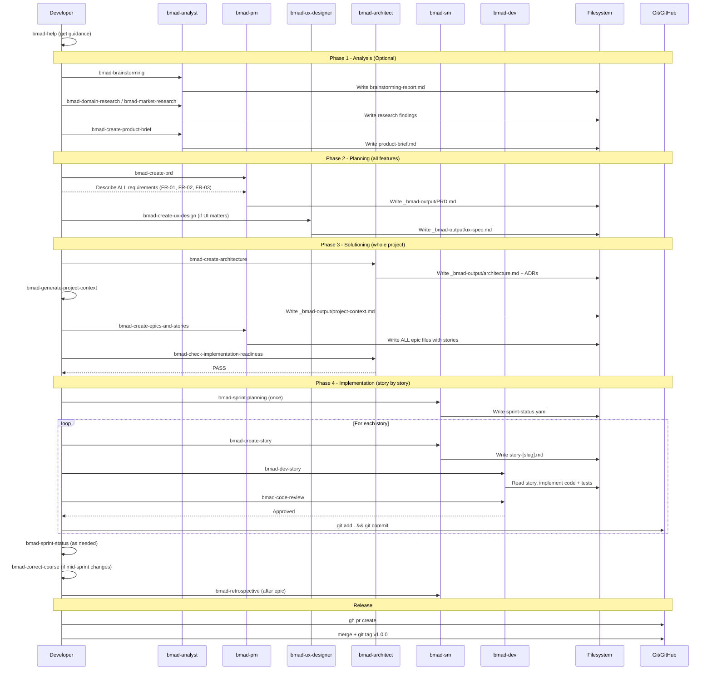
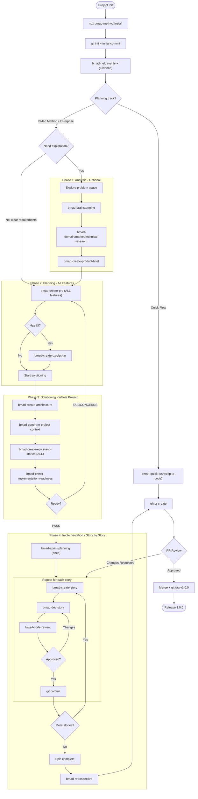

# How to Implement Features with BMAD Method

**Source:** https://github.com/bmad-code-org/BMAD-METHOD
**Docs:** https://docs.bmad-method.org
**Philosophy:** Multi-agent role-play (PM, Architect, Dev, Scrum Master) with scale-adaptive intelligence. Progressive context building across 4 phases -- each phase produces documents that inform the next, so agents always know what to build and why.

---

## Prerequisites

- Node.js v20+
- Git
- AI IDE (Claude Code, Cursor, Windsurf, Copilot, etc.)

## Key Concepts

- **Agents** are specialized personas (skill IDs like `bmad-pm`, `bmad-dev`) invoked as skills. Each agent has a menu with **triggers** (short codes like `CP`, `DS`).
- **Workflows** (like `bmad-create-prd`, `bmad-dev-story`) can be run directly as skills OR through an agent's menu trigger.
- **`bmad-help`** is available at any time to tell you what to do next. It also evolves when extended modules are installed, so it always knows everything available in your project. It runs automatically at the end of every workflow to tell you exactly what to do next.
- **`project-context.md`** is a recommended file that acts as a constitution for your project -- guiding implementation decisions across all workflows. Generate it via `bmad-generate-project-context` or create it manually at `_bmad-output/project-context.md`.
- **Fresh chats:** Always start a fresh chat for each workflow. This prevents context limitations from causing issues.

### Planning Tracks

| Track | Best For | Documents Created |
|---|---|---|
| Quick Flow | Bug fixes, simple features, clear scope (1-15 stories) | Tech-spec only |
| BMad Method | Products, platforms, complex features (10-50+ stories) | PRD + Architecture + UX |
| Enterprise | Compliance, multi-tenant systems (30+ stories) | PRD + Architecture + Security + DevOps |

### Agents Reference

| Agent | Skill ID | Triggers | Primary Workflows |
|---|---|---|---|
| Analyst (Mary) | `bmad-analyst` | BP, RS, CB, DP | Brainstorm, Research, Create Brief |
| Product Manager (John) | `bmad-pm` | CP, VP, EP, CE, IR, CC | Create/Validate PRD, Create Epics+Stories, Readiness Check |
| Architect (Winston) | `bmad-architect` | CA, IR | Create Architecture, Implementation Readiness |
| Scrum Master (Bob) | `bmad-sm` | SP, CS, ER, CC | Sprint Planning, Create Story, Retrospective |
| Developer (Amelia) | `bmad-dev` | DS, CR | Dev Story, Code Review |
| QA Engineer (Quinn) | `bmad-qa` | QA | Generate tests |
| Quick Flow (Barry) | `bmad-master` | QD, CR | Quick Dev, Code Review |
| UX Designer (Sally) | `bmad-ux-designer` | CU | Create UX Design |

---

## Project Setup

```bash
mkdir my-project && cd my-project
git init
npx bmad-method install
# Select: your AI tool (e.g., Claude Code)
# Select: All modules for full workflow
```

```bash
git add .
git commit -m "chore: initialize project with BMAD Method"
git remote add origin <your-repo-url>
git push -u origin main
```

Verify installation inside your AI IDE:

```
bmad-help
```

---

## Quick Flow (Parallel Track)

For small, well-understood work that doesn't need full planning and solutioning, use the Quick Flow to skip Phases 1-3 entirely:

```
bmad-master
```

Select `QD` (Quick Dev). Or run directly:

```
bmad-quick-dev
```

This unified workflow clarifies intent, plans, implements, reviews, and presents -- all in one pass.

**Produces:** `spec-*.md` + working code.

Use this when the change is small enough that a full PRD/Architecture/Epic cycle would be overkill. For the full method, continue below.

---

## Step 1: Create Your Plan (Phases 1-3)

Phases 1-3 are done **once for the entire project**, covering all features. Each workflow should run in a fresh chat.

### Phase 1: Analysis (Optional)

If you're starting from a vague idea rather than clear requirements, use Phase 1 to explore the problem space before committing to planning.

Load the Analyst agent:

```
bmad-analyst
```

| Step | Trigger | Workflow | Produces |
|---|---|---|---|
| Brainstorm ideas | `BP` | `bmad-brainstorming` | `brainstorming-report.md` |
| Research assumptions | `RS` | `bmad-domain-research`, `bmad-market-research`, `bmad-technical-research` | Research findings |
| Capture strategic vision | `CB` | `bmad-create-product-brief` | `product-brief.md` |

Skip this phase if you already have clear requirements and jump straight to Phase 2.

### Phase 2: Planning (Required)

Define what to build and for whom. The PRD should cover **all features** for the project.

Load the PM agent in a fresh chat:

```
bmad-pm
```

From the PM menu, select `CP` (Create PRD). Describe **all** your requirements:

> "Build a task board app. FR-01: Users can register with email and password, system validates input, hashes password, stores user, returns JWT, rejects duplicate emails. FR-02: Users can create, rename, and delete boards, each board belongs to one user, list boards for authenticated user. FR-03: Users receive real-time notifications via WebSocket when a card assigned to them changes status."

Alternatively, run the workflow directly as a skill:

```
bmad-create-prd
```

**Produces:** `_bmad-output/PRD.md` with functional requirements, non-functional requirements, acceptance criteria for the entire project.

#### UX Design (Optional -- when UI matters)

If the project has a user-facing interface, design the experience after creating the PRD. In a fresh chat:

```
bmad-ux-designer
```

Select `CU` (Create UX Design). Or run directly:

```
bmad-create-ux-design
```

**Produces:** `_bmad-output/ux-spec.md` with user flows, wireframe descriptions, and interaction patterns.

Skip this step for backend-only projects.

### Phase 3: Solutioning

Decide how to build it and break work into stories. All workflows in this phase use the PRD (and UX spec if created) as input.

#### Create Architecture

In a fresh chat, load the Architect agent:

```
bmad-architect
```

Select `CA` (Create Architecture). Or run the workflow directly:

```
bmad-create-architecture
```

**Produces:** `_bmad-output/architecture.md` with tech stack decisions, data model, API contracts, and ADRs covering the entire project.

#### Generate Project Context (Recommended)

After architecture is created, generate the project context file:

```
bmad-generate-project-context
```

**Produces:** `_bmad-output/project-context.md` -- ensures all AI agents follow your project's rules and preferences throughout implementation.

#### Create Epics and Stories

In a fresh chat, return to the PM agent to decompose **all** requirements into implementable work:

```
bmad-pm
```

Select `CE` (Create Epics and Stories). Or run directly:

```
bmad-create-epics-and-stories
```

This workflow uses both the PRD and Architecture to create technically-informed stories. Stories are better quality because architecture decisions (database, API patterns, tech stack) directly affect how work should be broken down.

**Produces:** Epic files with stories under `_bmad-output/` -- covering all features (FR-01, FR-02, FR-03, etc.).

#### Implementation Readiness Gate (Highly Recommended)

In a fresh chat, check whether the project is ready for implementation:

```
bmad-check-implementation-readiness
```

Or via PM (`IR`) or Architect (`IR`). Validates cohesion across all planning documents. Returns **PASS**, **CONCERNS**, or **FAIL**. If it fails, revisit earlier phases to fix the gaps before proceeding.

---

## Step 2: Build Your Project (Phase 4)

Once planning is complete, move to implementation. Each workflow should run in a fresh chat. You build **story by story**, not feature by feature.

### Initialize Sprint Planning (once per project)

Load the Scrum Master to initialize sprint tracking:

```
bmad-sm
```

Select `SP` (Sprint Planning). Or run directly:

```
bmad-sprint-planning
```

**Produces:** `sprint-status.yaml` to track all epics and stories through the dev cycle.

### The Build Cycle

For each story, repeat this cycle in fresh chats:

| Step | Agent | Workflow | Purpose |
|---|---|---|---|
| 1 | SM (Bob) | `bmad-create-story` | Create story file from epic |
| 2 | DEV (Amelia) | `bmad-dev-story` | Implement the story |
| 3 | DEV (Amelia) | `bmad-code-review` | Quality validation (recommended) |

#### Example: Story 1 -- User Registration Endpoint

**Create the story** (fresh chat):

```
bmad-create-story
```

**Produces:** `story-user-registration.md` with focused implementation context, acceptance criteria, and technical notes.

**Implement the story** (fresh chat):

```
bmad-dev-story
```

The Dev agent reads the story file and implements: endpoint, validation, password hashing, JWT generation, and tests.

**Produces:** Working code + tests.

**Code review** (fresh chat):

```
bmad-code-review
```

**Produces:** Approved or changes requested. If changes are requested, go back to `bmad-dev-story`.

**Commit:**

```bash
git add .
git commit -m "feat(auth): add user registration (FR-01)"
git push
```

#### Example: Story 2 -- Board CRUD

Repeat the same cycle:

```
bmad-create-story    # creates story-board-management.md
bmad-dev-story       # implements board CRUD
bmad-code-review     # validates quality
```

```bash
git add .
git commit -m "feat(boards): add board management (FR-02)"
git push
```

#### Example: Story 3 -- Real-time Notifications

```
bmad-create-story    # creates story-notifications.md
bmad-dev-story       # implements WebSocket notifications
bmad-code-review     # validates quality
```

```bash
git add .
git commit -m "feat(notifications): add real-time notifications (FR-03)"
git push
```

### Supporting Workflows (as needed)

These workflows can be used at any point during the build cycle:

**Sprint Status** -- track progress and story status:

```
bmad-sprint-status
```

**Correct Course** -- handle significant mid-sprint changes (scope change, blocking dependency, pivoted requirements):

```
bmad-correct-course
```

**Produces:** Updated plan or re-routing decision. Use this instead of just pushing through when the original plan no longer fits.

**Epic Retrospective** -- review after completing all stories in an epic:

```
bmad-sm
```

Select `ER` (Epic Retrospective). Or run directly:

```
bmad-retrospective
```

**Produces:** Lessons learned from the implementation cycle.

---

## Release

After all stories are implemented and reviewed:

```bash
gh pr create \
  --title "Release 1.0.0 -- User Registration, Boards, Notifications" \
  --body "## Summary
- FR-01: User registration with JWT
- FR-02: Board CRUD operations
- FR-03: Real-time notifications via WebSocket

## BMAD Artifacts
- PRD.md, architecture.md (with ADRs), epic/story files
- sprint-status.yaml tracking all stories
- Implementation readiness gate passed
- Code review approved for all stories"
```

After PR approval and merge:

```bash
git checkout main && git pull
git tag v1.0.0
git push --tags
```

---

## BMAD Artifacts

After completing the full workflow, your project should contain:

```
your-project/
├── _bmad/                              # BMad configuration
├── _bmad-output/
│   ├── planning-artifacts/
│   │   ├── PRD.md                      # Requirements (all features)
│   │   ├── architecture.md             # Technical decisions + ADRs
│   │   ├── ux-spec.md                  # UX design (if applicable)
│   │   └── epics/                      # Epic and story files
│   ├── implementation-artifacts/
│   │   └── sprint-status.yaml          # Sprint tracking
│   └── project-context.md              # Implementation rules (recommended)
└── src/                                # Your working code
```

---

## Sequence Diagram



---

## Process Diagram


